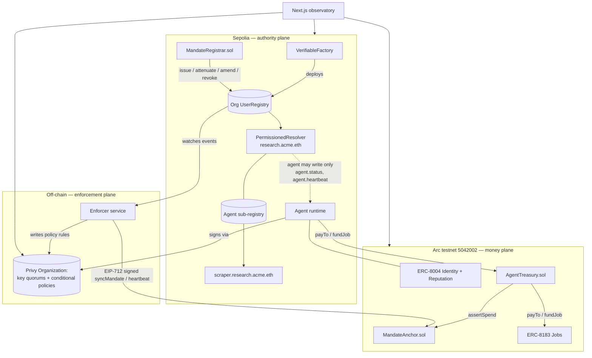

# Architecture

Three planes, one source of truth. Identity and permissions belong on Ethereum, where they're
portable and legible to any counterparty. High-frequency machine payments belong on a chain where
gas is USDC and settlement is deterministic. The split is the design, not a limitation to work
around — see mandate.md's original framing, which this build holds to.

## The three planes

**Authority (Sepolia).** `MandateRegistrar` deploys and owns its org's ENSv2 `UserRegistry` at
construction — self-contained, no external wiring step required beyond pointing the org's 2LD's
subregistry at it. Issuing a mandate:

1. Deploys a dedicated `PermissionedResolver` instance for that name.
2. Writes every `mandate.*` record inside the resolver's `initialize()` batch — atomic, one call.
3. Registers the name with a **zero registry-level role bitmap**: no `ROLE_CAN_TRANSFER_ADMIN`
   (soulbound), no `ROLE_RENEW` (self-expiring). Nothing to withhold later — admin roles are
   settable only at registration, so the bitmap has to be right the first time.
4. Grants the agent `authorizeTextRoles` on exactly three keys — `agent.status`,
   `agent.heartbeat`, `agent.output.last` — as **separate calls after deployment**, not inside the
   same `initialize()` batch. This is a real integration bug the Sepolia fork tests caught: the
   resolver's permission-check bypass during `initialize()` covers direct setters (`setText` et
   al.) but not the `authorizeTextRoles` grant path, and `multicall`'s delegatecall relay preserves
   the deploying `VerifiableFactory` as `msg.sender` throughout the whole init batch. Granting
   inside that batch would need the factory itself to hold admin rights — which nothing should
   ever grant it.

A sub-agent's mandate is created by `attenuate`, self-service by the parent's own agent wallet,
checked against the parent's *current* headroom (depth, expiry, per-tx cap, remaining budget) —
all narrow monotonically, enforced by the contract's own arithmetic. The allowlist root is
**inherited verbatim** rather than re-supplied: proving one merkle root is a subset of another
on-chain is expensive, so inheritance makes widening structurally impossible instead of merely
checked.

**Enforcement (off-chain).** The Enforcer watches Sepolia and propagates — never originates —
state into two independent enforcement points: a Privy conditional policy, and a signed
`MandateAnchor.syncMandate` call on Arc. It is a propagator, not an authority: every write is
EIP-712 signed and independently reproducible from the Sepolia state it mirrors. Revocation reuses
the same `syncMandate` path with `revoked: true`, rather than a separate signing scheme — one
code path, the same nonce-monotonicity guarantee.

**Money (Arc).** `MandateAnchor.assertSpend` is the gate every payment passes through, checked in
order: revoked → expired → over the per-tx cap → recipient not allowlisted → **stale**. The last
one is deliberate and is the strongest security property in the system: a dead or censored
Enforcer freezes every agent instead of leaving them unsupervised. `AgentTreasury` is the org's
USDC pool, structured as a revolving credit facility — agents draw against it directly to pay a
counterparty (`payTo`) or fund an ERC-8183 job (`fundJob`), never routing pooled funds through
their own wallet. A leaky-bucket accumulator — not a fixed window — tracks the mandate's rolling
budget, decaying linearly rather than resetting on a timestamp boundary.

## Why the split is a feature

Privy's own stateful policies cap at roughly ten rolling-budget aggregations per app, can't
partition by wallet, and — by Privy's own documentation — update their aggregation values *after*
a request signs, not before, so concurrent spends can both pass. None of that is a criticism of
Privy; it's evidence for *why a chain is load-bearing here* rather than decorative: public
verifiability (a counterparty can resolve the mandate before accepting a job), scale (no
ten-aggregation ceiling), and correctness under concurrency (the on-chain ledger closes the race
Privy's own docs admit).

## Known limitations

Stated here, not discovered by a judge. Full detail at `/docs/security`.

- The Enforcer is a single off-chain service. It can only narrow or revoke a mandate — never widen
  one — but it is a liveness dependency: `assertSpend` fails closed once its staleness window
  elapses, freezing every agent rather than leaving them unsupervised.
- A sub-agent's allowlist is inherited verbatim from its parent, not independently choosable.
- Interest accrual (`AgentTreasury.accrue`) is simple, not compounding on a schedule — the first
  thing this design would cut under time pressure.
- `AgentTreasury.fundJob`'s call into the ERC-8183 reference Jobs contract was verified against its
  deployed selectors, not against an end-to-end call on live infrastructure — this build was kept
  independent of live credentials throughout.
